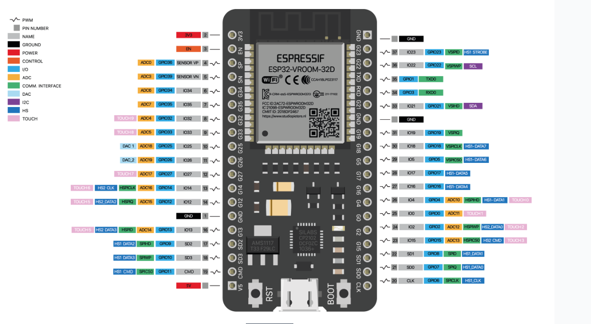

# Riego Interno

Water plant in a interior monitoring the humidity and pump water from a small deposit.
refill the deposit from a bigger container.

This may sound dumb but was the better solution I find with the resources I have at this time,
this can be improved later.

- 4 humidity sensors
- 5 pumps
- 3 water level sensors

the connections were done based on a ESP32-Wroom 38 pins as shown in the figure

